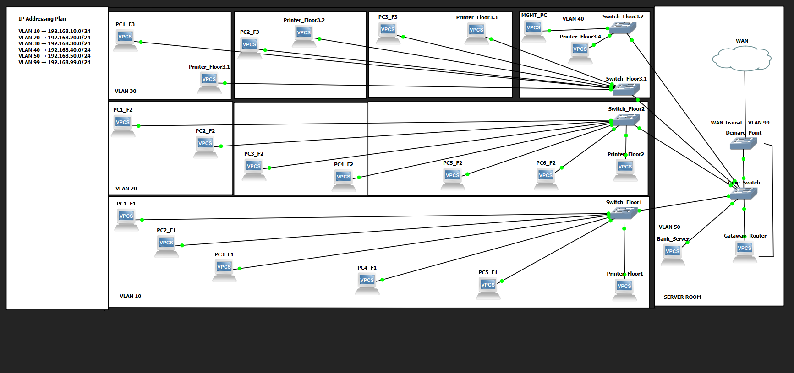
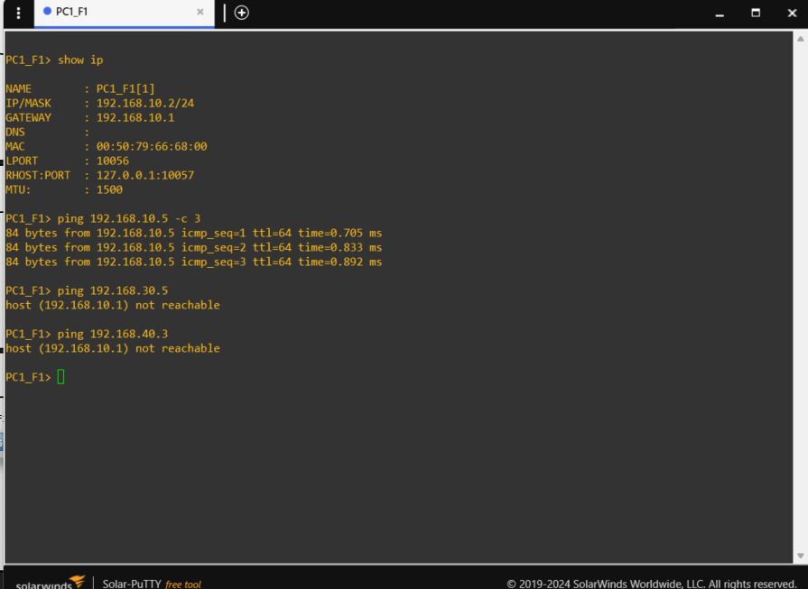

# VLAN Network Design

## Overview

This project demonstrates a small bank branch network topology built in GNS3.

The network is segmented using VLANs to separate users, management systems, servers, and WAN transit traffic.

## Network Topology

## VLAN and IP Addressing Plan

| VLAN | Purpose | Network |
|------|----------|----------|
| VLAN 10 | Floor 1 Users | 192.168.10.0/24 |
| VLAN 20 | Floor 2 Users | 192.168.20.0/24 |
| VLAN 30 | Floor 3 Users | 192.168.30.0/24 |
| VLAN 40 | Management Network | 192.168.40.0/24 |
| VLAN 50 | Server Network | 192.168.50.0/24 |
| VLAN 99 | WAN Transit Network | 192.168.99.0/24 |

## Components

- Core Switch
- Access Switches
- Management Workstation
- Bank Server
- Gateway Router (placeholder)
- ISP Demarcation Point
- WAN Connection

## Validation Tests

The following test confirms VLAN isolation:

### Test Results

| Test | Result |
|--------|--------|
| VLAN 10 → VLAN 10 | Success |
| VLAN 10 → VLAN 30 | Blocked |
| VLAN 10 → VLAN 40 | Blocked |

## Current Status

Implemented:

- VLAN segmentation
- IP addressing plan
- Core/Access switch architecture
- Management VLAN
- Server VLAN
- WAN Transit VLAN

Planned Improvements:

- Inter-VLAN routing
- ACL rules
- Firewall integration
- DHCP services
- Monitoring and logging

## Technologies Used

- GNS3
- Ethernet Switches
- VPCS
- TCP/IP
- VLAN Segmentation
